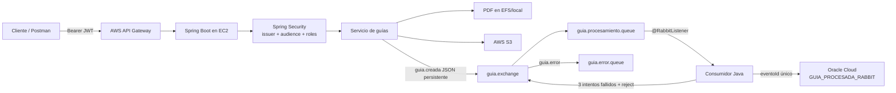
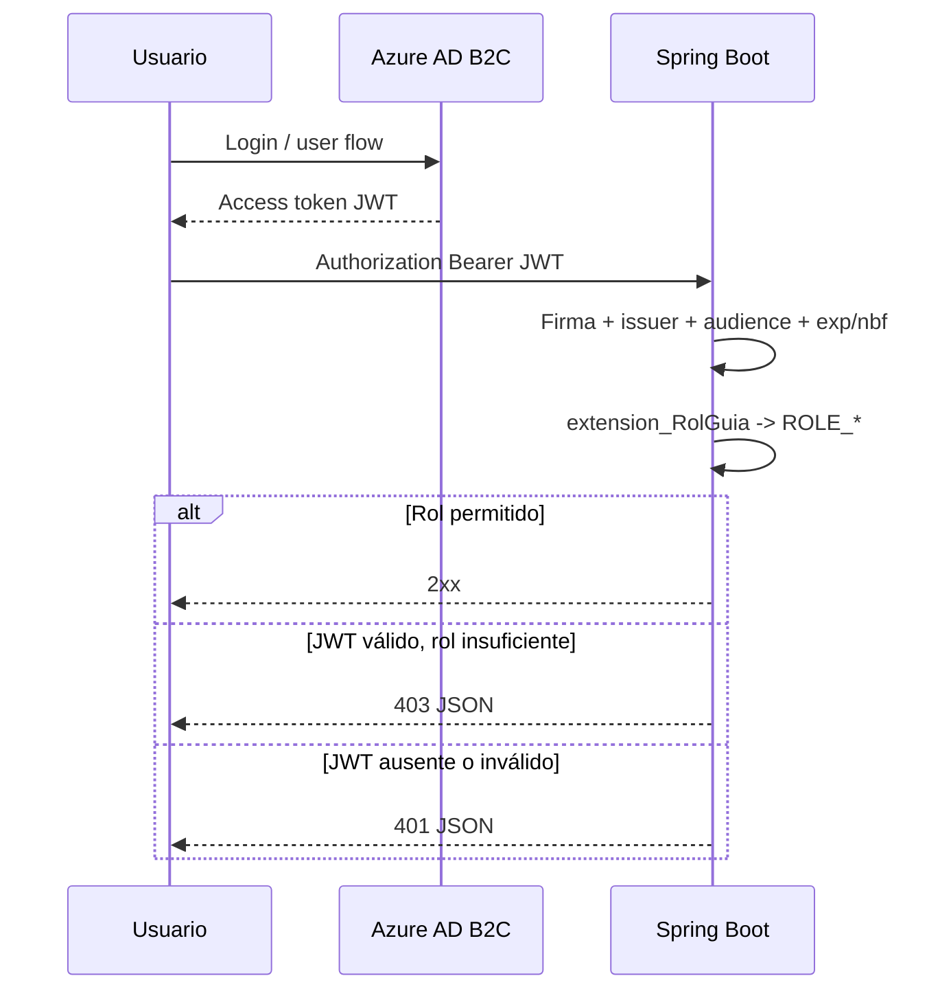

# Arquitectura

## Componentes

- `GuiaDespachoController` y `GuiaDespachoService`: CRUD, PDF, EFS/local y S3.
- `SecurityConfig`: Resource Server stateless, validación JWT, CORS y reglas explícitas.
- `GuiaEventoPublisher`: DTO JSON persistente a RabbitMQ con message ID y correlation ID.
- `GuiaEventoConsumer`: listener automático con reintentos finitos.
- `GuiaProcesamientoService`: persistencia transaccional e idempotente.
- `GUIA_PROCESADA_RABBIT`: tabla diferente de `GUIA_DESPACHO`, con `EVENTO_ID` único.
- RabbitMQ: exchange directo y dos colas durables.

## Flujo exitoso

1. API Gateway reenvía el bearer token y la solicitud.
2. Spring valida firma, `iss`, `aud`, vigencia y `extension_RolGuia`.
3. `POST /api/guias` valida el body, guarda metadata, genera PDF, sube a S3 si está habilitado y publica `GuiaEvento`.
4. RabbitMQ persiste y enruta el mensaje a la cola principal.
5. El listener consume sin bloquear la respuesta HTTP.
6. El consumidor consulta `EVENTO_ID`; si ya existe confirma sin insertar otra fila. Si no existe, inserta en la tabla nueva.

## Flujo de error

El endpoint protegido acepta `simularError=true` exclusivamente cuando `RABBITMQ_ERROR_SIMULATION_ENABLED=true`. La variable vale `false` por defecto; si permanece deshabilitada, la API responde `403` antes de buscar la guía o publicar. En una demo habilitada, el consumidor lanza una excepción controlada antes de persistir. El interceptor ejecuta como máximo tres intentos con backoff. Tras agotarlos, `RejectAndDontRequeueRecoverer` rechaza sin requeue; los argumentos DLX de la cola principal enrutan el mensaje a `guia.error.queue`. La cola de error no tiene binding de regreso a la principal, evitando bucles.

## Consistencia e idempotencia

- Mensaje AMQP durable y delivery mode `PERSISTENT`.
- Exchange, colas y bindings declarados por Spring como durables.
- UUID por evento, restricción única e inspección previa.
- El sistema ofrece entrega al menos una vez. No implementa outbox transaccional: una caída entre commit de base y publish puede requerir reproceso mediante el endpoint `202`. Es un riesgo conocido y aceptable para el alcance académico.

## Autenticación y autorización

`DESCARGA_GUIAS` solo descarga; `GESTION_GUIAS` usa las operaciones restantes. No se convierten scopes en roles ni se concede rol por defecto. Solo health es público; cualquier ruta no inventariada se deniega.

## Integraciones cloud

- S3: cliente AWS SDK v2, región/bucket externos, credenciales desde rol IAM.
- Oracle Cloud: JDBC externo y perfil `oracle`; tabla creada por SQL controlado.
- EC2: contenedor no root, health check y EFS montado.
- API Gateway: integración HTTP proxy hacia EC2/ALB, authorizer JWT compatible o seguridad delegada al backend; en ambos casos se reenvía `Authorization`.
